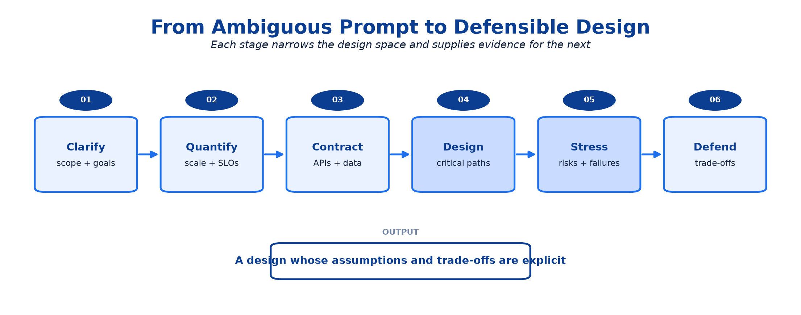
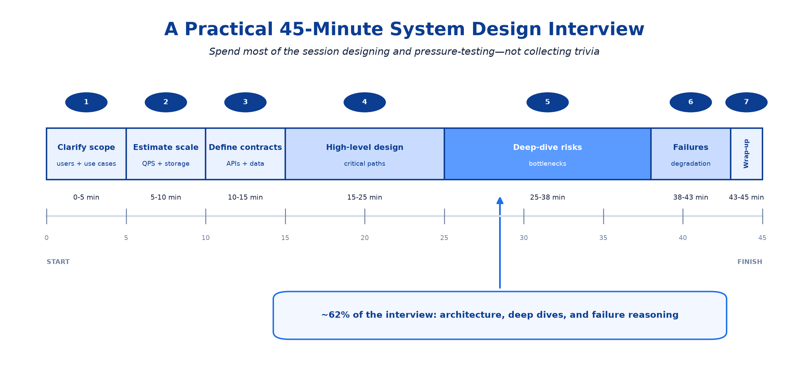
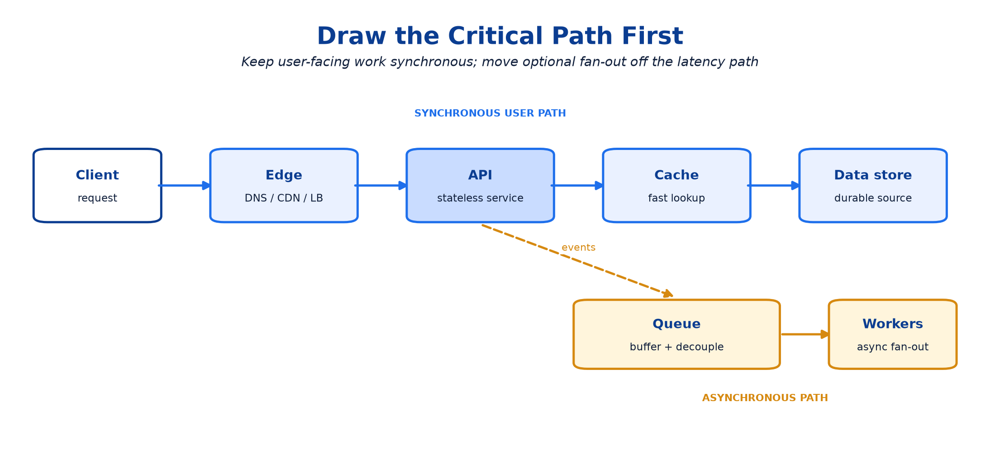
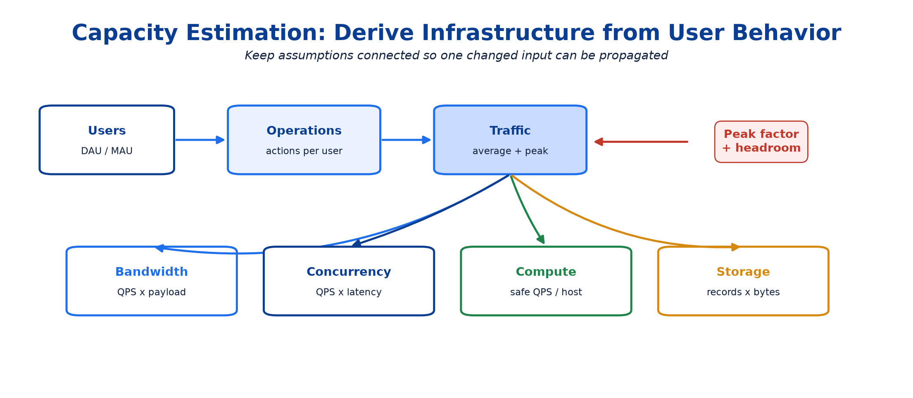
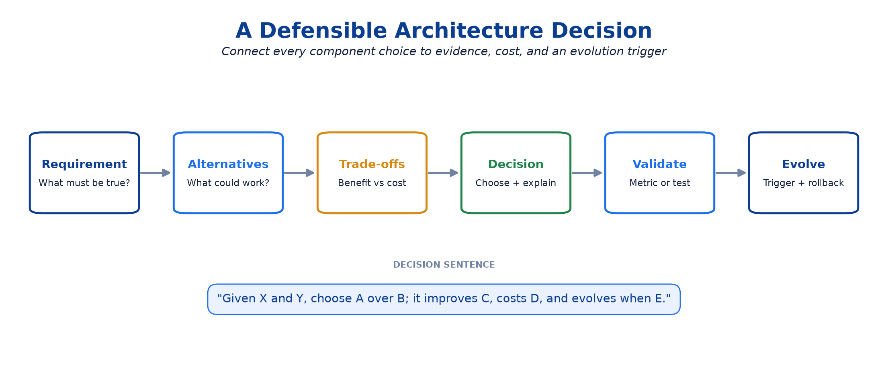
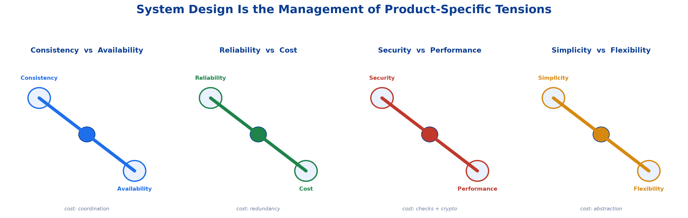
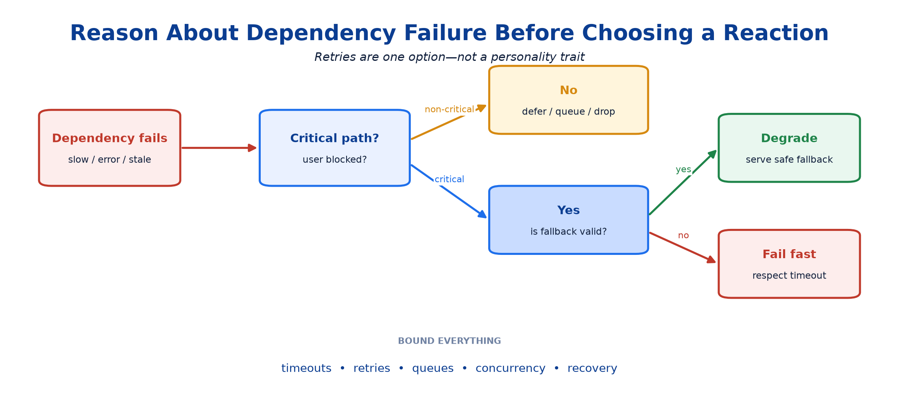
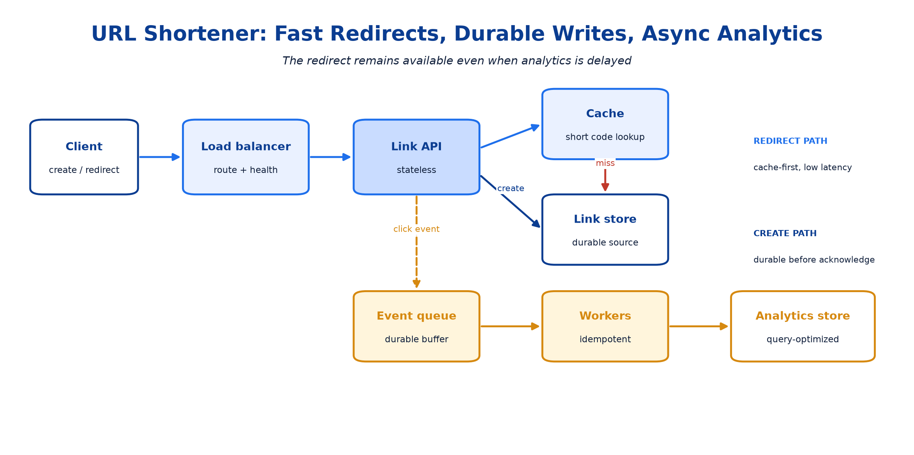

# <span style="color:#0B3D91">System Design Interview Framework &amp; Capacity Estimation</span>

> Interview-ready notes for turning an ambiguous product idea into a defensible architecture: clarify requirements, quantify scale, draw the critical path, find bottlenecks, and choose deep dives deliberately.
>
> The goal is not to guess the interviewer's hidden diagram. It is to make assumptions explicit and show disciplined engineering judgment.

> **A note on calculations:** equations use plain-text code blocks rather than LaTeX so they render in any Markdown viewer. Numbers are estimates, not prophecies carved into a load balancer.

---

## <span style="color:#1E6FEB">Table of Contents</span>

1. [Definition and Motivation](#1-definition-and-motivation)
2. [Core Concepts and Terminology](#2-core-concepts-and-terminology)
3. [How the Interview Framework Works](#3-how-the-interview-framework-works)
4. [Capacity Estimation](#4-capacity-estimation)
5. [Design Alternatives and Decision Framework](#5-design-alternatives-and-decision-framework)
6. [Scalability, Reliability, Security, and Cost Trade-offs](#6-scalability-reliability-security-and-cost-trade-offs)
7. [Failure Modes, Operational Concerns, and Common Mistakes](#7-failure-modes-operational-concerns-and-common-mistakes)
8. [Worked Example: URL Shortener](#8-worked-example-url-shortener)
9. [Senior and Principal-Level Interview Discussion](#9-senior-and-principal-level-interview-discussion)
10. [Common Interview Questions](#10-common-interview-questions)
11. [Final Revision Cheat Sheet and Key Takeaways](#11-final-revision-cheat-sheet-and-key-takeaways)

---

## <span style="color:#1E6FEB">1. Definition and Motivation</span>
### 1.1 What is a system design interview framework?
A **system design interview framework** is a repeatable process for converting an underspecified problem into an architecture whose decisions can be explained and defended.



The diagram shows progressive constraint discovery. Each stage reduces the design space; jumping directly from the prompt to technology selection skips the evidence needed to justify those choices.
### 1.2 Why it matters
A strong interview answer demonstrates that you can:

- separate product requirements from architecture preferences;
- quantify the forces acting on the system;
- identify the critical read and write paths;
- reason about failure instead of drawing only the happy path;
- communicate trade-offs while managing limited interview time;
- adapt the design when an assumption changes.

> **Interview principle:** A good design is not the one with the most components. It is the simplest design that satisfies the stated constraints and has a credible evolution path.
### 1.3 What the interviewer is evaluating
| Signal | What good performance looks like |
|---|---|
| Requirement discovery | Asks high-leverage questions and controls scope |
| Technical breadth | Recognizes relevant storage, compute, networking, and messaging choices |
| Technical depth | Explains selected components beyond their names |
| Quantitative reasoning | Uses estimates to expose bottlenecks and validate feasibility |
| Trade-off judgment | States benefits, costs, risks, and rejected alternatives |
| Communication | Maintains a clear narrative and responds to new constraints |
| Seniority | Connects architecture to operations, migration, security, and organizational impact |

---

## <span style="color:#1E6FEB">2. Core Concepts and Terminology</span>
### 2.1 Functional vs non-functional requirements
| Requirement type | Question it answers | Examples |
|---|---|---|
| **Functional** | What must users or systems be able to do? | Create a short URL, redirect, expire a link |
| **Non-functional** | How well must the system behave? | Latency, availability, durability, and consistency targets |
| **Constraint** | What boundary cannot be ignored? | Data residency, existing database, delivery deadline |
| **Out of scope** | What are we deliberately not designing now? | Analytics dashboard, abuse review UI |

A feature list says **what exists**. Non-functional requirements determine **how it must be built**.
### 2.2 Essential quality attributes
| Attribute | Practical meaning | Example target |
|---|---|---|
| Latency | Time to complete an operation | Redirect p99 below 100 ms |
| Throughput | Work completed per unit time | 100,000 peak reads/second |
| Availability | Fraction of time requests can be served | 99.99% monthly |
| Durability | Probability acknowledged data is not lost | No acknowledged links lost |
| Consistency | Which versions of data readers may observe | Read-after-write for link creation |
| Scalability | Ability to handle growth without redesigning everything | 10× traffic with horizontal scaling |
| Security | Protection against unauthorized use and disclosure | Authenticated writes, encrypted transport |
| Cost efficiency | Resources consumed per useful operation | Storage tiering for old analytics |
### 2.3 Workload vocabulary
- **Read/write QPS (RPS):** queries or requests per second for each path.
- **Average traffic:** total operations divided by elapsed time.
- **Peak traffic:** highest expected rate during a meaningful interval.
- **Read/write ratio:** relative frequency of reads and writes.
- **Payload size:** bytes entering or leaving per operation.
- **Working set:** data accessed frequently enough to benefit from memory or cache.
- **Concurrency:** simultaneous in-flight operations.
- **Fan-out:** downstream work triggered by one request.
- **Headroom:** spare capacity reserved for bursts, failures, and growth.
### 2.4 Assumptions are design inputs
Use explicit assumptions rather than silently inventing facts:

> "I will assume 100 million monthly active users, 10% daily activity, and a 10:1 peak-to-average factor. If traffic is flatter, we can reduce provisioned headroom."

This makes the design adjustable. If the interviewer changes a number, update the affected decision rather than restarting the entire answer.

---

## <span style="color:#1E6FEB">3. How the Interview Framework Works</span>
### 3.1 A practical 45-minute flow


The time boxes are guidance, not ceremony. The important behavior is to reserve most of the interview for architecture and deep dives while preventing requirement discovery from becoming an archaeological expedition.
### 3.2 Step 1 — Clarify the problem and control scope
Ask a small number of discriminating questions:

1. Who are the users and what are the top two or three use cases?
2. What is explicitly out of scope?
3. What scale exists now, at peak, and in the expected future?
4. Which matters more for each path: consistency, availability, or latency?
5. Are there security, privacy, residency, or retention requirements?
6. Is this greenfield, or must it integrate with an existing system?

Then restate the scope:

> "I will design link creation and low-latency redirects. Basic click-event capture is included, but analytics queries and custom domains are out of scope."
### 3.3 Step 2 — Identify operations and access patterns
| Operation | Actor | Frequency | Critical property |
|---|---|---:|---|
| Create | User/service | Low | Uniqueness, durability |
| Read | User/service | High | Low latency, availability |
| Update | Owner | Low | Authorization, consistency |
| Delete/expire | Owner/system | Low | Correct propagation |

Access patterns determine data models and indexes. Designing a schema before identifying them is database-themed fortune-telling.
### 3.4 Step 3 — Define contracts and core entities
Keep APIs and data models minimal at first:

```text
POST /links
Request:  { long_url, custom_alias?, expires_at? }
Response: { short_code, short_url }

GET /{short_code}
Response: HTTP 302 with Location: <long_url>
```

```text
Link {
  short_code: string       // primary lookup key
  long_url: string
  owner_id: string?
  created_at: timestamp
  expires_at: timestamp?
}
```

The interface reveals validation, idempotency, authentication, and consistency needs. The entity reveals keys, indexes, storage size, and lifecycle.
### 3.5 Step 4 — Draw the critical path first


This generic shape separates the synchronous user path from optional asynchronous work. Explain each arrow: request direction, data transferred, and behavior when the destination is slow or unavailable.
### 3.6 Step 5 — Find bottlenecks and choose deep dives
Ask of every component:

- What is its expected QPS and data volume?
- Is it stateful? How does it scale?
- What happens when it is slow, unavailable, or returns stale data?
- Is it on the critical path?
- Does it introduce a single point of failure?
- Which assumption would make it fail first?

Choose two or three deep dives based on risk, not personal hobbyhorses. Typical deep dives include partitioning, caching, consistency, queue semantics, hot keys, multi-region behavior, or zero-downtime migration.
### 3.7 Step 6 — Close with evolution
Summarize:

- requirements satisfied;
- major decisions and trade-offs;
- current bottleneck;
- failure behavior;
- how the architecture evolves at 10× scale.

---

## <span style="color:#1E6FEB">4. Capacity Estimation</span>
### 4.1 Why estimate?
Capacity estimates answer architectural questions:

- Is one database plausible, or is partitioning immediately required?
- Does the working set fit in memory?
- Is network bandwidth or storage growth the dominant cost?
- Can asynchronous consumers keep up with producers?
- How much headroom is required during an instance or zone failure?

Use **back-of-the-envelope calculations** only for numbers that can change a decision. Calculating twelve decimal places for daily QPS is decorative arithmetic.
### 4.2 Core formulas
```text
Average QPS = operations per day / 86,400
Peak QPS    = average QPS * peak factor

Ingress bandwidth = write QPS * average request bytes
Egress bandwidth  = read QPS * average response bytes

Storage = records * bytes per record * retention factor
Replicated storage = raw storage * replication factor

Concurrent requests ≈ throughput * average latency in seconds

Required instances = peak QPS / safe QPS per instance
Provisioned instances = required instances * headroom factor
```

The concurrency relationship is Little's Law applied to in-flight requests. For example, 10,000 requests/second at 200 ms average latency implies roughly 2,000 concurrent requests.
### 4.3 A disciplined estimation sequence


Start from user behavior, derive operations, and only then size infrastructure. This prevents unrelated assumptions from quietly contradicting one another.
### 4.4 Useful approximations
| Quantity | Approximation |
|---|---:|
| Seconds/day | 86,400 ≈ 100,000 |
| Seconds/month | ≈ 2.6 million |
| 1 KB | 10³ bytes for interview math |
| 1 MB | 10⁶ bytes |
| 1 GB | 10⁹ bytes |
| 1 TB | 10¹² bytes |

State whether you are using decimal approximations. Precision is less important than consistent units and visible assumptions.
### 4.5 Traffic example
Assume:

- 20 million daily active users;
- 5 reads per active user per day;
- 0.1 writes per active user per day;
- peak factor of 8× average.

```text
Reads/day       = 20M * 5   = 100M
Average read QPS = 100M / 100K ≈ 1,000
Peak read QPS    = 1,000 * 8 = 8,000

Writes/day       = 20M * 0.1 = 2M
Average write QPS = 2M / 100K ≈ 20
Peak write QPS    = 20 * 8 = 160

Read/write ratio = 100M / 2M = 50:1
```

The 50:1 ratio suggests optimizing reads and considering caching. It does **not** automatically prove that a cache is required; latency targets and database capability still matter.
### 4.6 Storage example
Assume 2 million new records/day, 600 bytes/record, five-year retention, and three replicas:

```text
Raw daily growth = 2M * 600 B = 1.2 GB/day
Raw five-year storage = 1.2 GB * 365 * 5 ≈ 2.2 TB
Replicated storage = 2.2 TB * 3 ≈ 6.6 TB
```

Add indexes, metadata, compaction overhead, backups, and growth margin separately. A useful planning estimate might be 2–4× the raw replicated data, depending on the storage engine and backup policy.
### 4.7 Bandwidth and concurrency example
Assume 8,000 peak reads/second, 2 KB responses, and 100 ms average latency:

```text
Peak egress = 8,000 * 2 KB = 16 MB/s ≈ 128 Mb/s
Concurrency ≈ 8,000 * 0.1 = 800 in-flight reads
```

This estimate informs connection pools, thread/event-loop capacity, load balancers, and network provisioning.
### 4.8 Headroom and failure capacity
If three equal zones normally carry traffic and one zone may fail, the remaining two must absorb the total load:

```text
Normal load per zone at full system demand = 1 / 3 = 33.3%
Load per surviving zone after one failure   = 1 / 2 = 50%
Required spare capacity per healthy zone    = 50% - 33.3% = 16.7% of total
Relative increase on each survivor          = 50 / 33.3 ≈ 1.5x
```

Provisioning each zone near 100% under normal traffic guarantees overload during a failure. Reliability requires deliberate unused capacity—and yes, finance will notice.

---

## <span style="color:#1E6FEB">5. Design Alternatives and Decision Framework</span>
### 5.1 Make decisions from requirements


A defensible decision links a requirement to alternatives, trade-offs, and a validation method. "Use Kafka because it scales" skips four of those five steps.
### 5.2 A compact decision record
| Field | Example |
|---|---|
| Context | Redirect path requires p99 below 100 ms at 8K peak QPS |
| Alternatives | Database-only reads; cache-aside; CDN/edge caching |
| Decision | Cache-aside initially |
| Optimizes for | Read latency and database load |
| Costs | Staleness, invalidation logic, operational dependency |
| Validation | Cache hit rate, p99 latency, database QPS |
| Evolution | Add edge caching if global traffic dominates |
### 5.3 Common alternatives
| Decision | Simpler starting point | Scale-oriented alternative | Trigger to evolve |
|---|---|---|---|
| Compute | Vertical scaling | Stateless horizontal scaling | Saturation or availability target |
| Data | Single relational DB | Replicas/partitioning/specialized store | QPS, size, or access-pattern limit |
| Reads | Database-only | Cache/CDN/read replicas | Latency or database pressure |
| Work | Synchronous call | Queue and workers | Slow/non-critical/fan-out work |
| Deployment | Single region | Active-passive/active-active | RTO, geography, or latency need |

> Prefer the simplest option that meets current requirements. Describe the trigger for complexity rather than installing every distributed-systems pattern on day one.

---

## <span style="color:#1E6FEB">6. Scalability, Reliability, Security, and Cost Trade-offs</span>
### 6.1 The quality-attribute tension map


These are tensions, not universal laws. The interview task is to locate which side matters more for each operation—for example, payments may favor correctness while a social feed may tolerate stale reads.
### 6.2 Trade-off checklist
| Dimension | Questions to ask | Typical cost |
|---|---|---|
| Scalability | Can state be partitioned? Are there hot keys? | Coordination and operational complexity |
| Reliability | What fails independently? Is redundancy tested? | Idle capacity and duplicate infrastructure |
| Consistency | What anomalies are acceptable per operation? | Latency or reduced availability |
| Security | Where are trust boundaries and sensitive data? | Additional checks, key management, audits |
| Cost | What drives compute, storage, network, and people cost? | Lower headroom or reduced capabilities |
| Operability | Can teams observe, deploy, recover, and migrate it? | Tooling and engineering investment |
### 6.3 Capacity is not performance
Provisioned capacity says the system has enough resources in theory. Performance testing verifies behavior under realistic distributions, hot keys, payloads, dependencies, and failures.

A senior answer distinguishes:

- **load test:** expected traffic;
- **stress test:** find the breaking point;
- **spike test:** sudden bursts;
- **soak test:** leaks and degradation over time;
- **failure test:** traffic while dependencies or zones fail.

---

## <span style="color:#1E6FEB">7. Failure Modes, Operational Concerns, and Common Mistakes</span>
### 7.1 Common interview mistakes
| Mistake | Why it hurts | Better approach |
|---|---|---|
| Jumping to components | Decisions lack requirements | Clarify scope and workload first |
| Treating averages as peaks | Under-sizes burst capacity | State a peak factor and headroom |
| False precision | Hides weak assumptions | Round numbers and show units |
| Estimating without consequence | Burns time without informing design | Tie every estimate to a decision |
| Ignoring writes | Read path looks fast while correctness breaks | Draw read and write paths separately |
| Naming technology without mechanics | Signals memorization | Explain partitioning, failure, and operations |
| Designing only the happy path | Reliability claims remain unproven | Walk through dependency failures |
| Premature multi-region design | Adds cost and conflict handling | Require an RTO, latency, or residency reason |
| No summary | Leaves trade-offs implicit | Close with decisions, risks, and evolution |
### 7.2 Estimation hazards
- mixing bits and bytes;
- forgetting replication, indexes, backups, and retention;
- using monthly users as if all are concurrently active;
- sizing consumers by message count but ignoring processing time;
- assuming traffic and key popularity are uniformly distributed;
- provisioning to benchmark maximum instead of a safe operating rate;
- omitting downstream fan-out from QPS calculations.
### 7.3 Operational questions that reveal maturity


The diagram provides a simple failure walk-through. Do not retry everything automatically: retries consume capacity and can turn a partial failure into a retry storm.

For each dependency, discuss:

- timeout and retry ownership;
- idempotency and duplicate handling;
- queue or connection-pool bounds;
- stale-data fallback;
- health signals and alerts;
- recovery and reconciliation after restoration.

---

## <span style="color:#1E6FEB">8. Worked Example: URL Shortener</span>
### 8.1 Scope and targets
**Functional requirements**

- Create a short link for a valid URL.
- Redirect a short code to its destination.
- Optionally expire links.

**Out of scope:** custom domains, analytics queries, and admin UI.

**Non-functional assumptions**

- Redirect p99 below 100 ms.
- High read availability.
- A successfully created link must not be lost.
- Read-after-write should hold for newly created links.
### 8.2 Capacity assumptions
- 20 million new links/month.
- 100:1 redirect-to-create ratio.
- 10× peak factor.
- 700 bytes stored per link including estimated index overhead.
- Five-year retention and three replicas.

```text
Average creates/s = 20M / 2.6M seconds ≈ 8
Peak creates/s    = 8 * 10 ≈ 80

Average redirects/s = 8 * 100 = 800
Peak redirects/s    = 800 * 10 = 8,000

Raw records in 5 years = 20M * 12 * 5 = 1.2B
Raw storage = 1.2B * 700 B ≈ 840 GB
Replicated storage = 840 GB * 3 ≈ 2.5 TB
```

The throughput is moderate; record count and read latency are more influential than raw write QPS. Start simple, partition when demonstrated limits or operational requirements demand it.
### 8.3 High-level design


**Redirect path:** the API looks up `short_code` in cache, falls back to the durable link store, populates the cache, and returns a redirect.

**Create path:** the API validates the URL, allocates a unique code, writes the durable store, and may populate or invalidate cache state. Click analytics remain off the redirect critical path.
### 8.4 Decisions and trade-offs
| Decision | Optimizes for | Costs / risks |
|---|---|---|
| Cache-aside redirects | Low latency, lower DB QPS | Staleness, hot keys, cache outages |
| Stateless APIs | Horizontal scaling and replacement | State must live in shared systems |
| Durable async analytics | Fast redirect path, traffic absorption | Event lag and duplicate processing |
| Random/base-encoded IDs | Compact keys and distribution | Collision strategy or coordination |
| Single region initially | Simplicity and cost | Regional outage and distant-user latency |
### 8.5 Failure walk-through
- **Cache unavailable:** temporarily bypass it with strict database concurrency limits; avoid a cache-miss stampede.
- **Database unavailable:** cached redirects may continue, but link creation should fail rather than acknowledge an undurable write.
- **Analytics queue unavailable:** redirects should continue; buffer only within safe bounds or drop non-critical events according to product requirements.
- **Hot short code:** replicate/cache heavily, use request coalescing, and consider edge caching.

---

## <span style="color:#1E6FEB">9. Senior and Principal-Level Interview Discussion</span>
### 9.1 What distinguishes senior reasoning?
A senior candidate should:

- attach decisions to measurable requirements;
- quantify the dominant workloads;
- explain normal and degraded behavior;
- recognize operational complexity as a real cost;
- offer a staged evolution rather than a maximal day-one architecture.
### 9.2 What distinguishes Staff/Principal reasoning?
A Staff or Principal candidate should additionally discuss:

- **system boundaries:** ownership, contracts, and coupling between teams;
- **evolution:** migrations, compatibility, rollback, and coexistence of versions;
- **blast radius:** failure domains, tenant isolation, and dependency criticality;
- **economics:** cost drivers, utilization, and build-vs-buy considerations;
- **governance:** security, privacy, auditability, and data lifecycle;
- **organizational scalability:** whether teams can independently operate the design;
- **uncertainty:** which assumptions need prototypes, tests, or production measurements.
### 9.3 Language for defending decisions
Use a consistent structure:

> "Given **requirement X** and **estimate Y**, I would choose **A** over **B** because it improves **property C**. The cost is **D**. I would validate it using **metric/test E**, and evolve to **F** when **trigger G** occurs."

Example:

> "Given 8,000 peak redirects per second and a 100 ms p99 target, I would start with cache-aside rather than database-only reads. It reduces database load and tail latency, at the cost of invalidation and another dependency. I would validate p99 latency, hit rate, and origin QPS, adding edge caching only if geography or hot links justify it."
### 9.4 Handling changing requirements
When the interviewer adds a constraint:

1. identify which quality attribute changed;
2. trace the affected request/data paths;
3. revise only the necessary components;
4. explain new costs and failure modes;
5. update capacity estimates if the workload changed.

This demonstrates adaptability rather than attachment to the first diagram.

---

## <span style="color:#1E6FEB">10. Common Interview Questions</span>
### Q1. Do I need capacity estimates in every interview?
Use enough estimation to drive decisions. At minimum quantify peak QPS, read/write ratio, payload size, storage growth, and any unusual fan-out. Skip calculations that cannot influence the architecture.
### Q2. What if the interviewer provides no scale?
Propose reasonable assumptions, say them aloud, and invite correction. Prefer round numbers that make recalculation easy.
### Q3. Average QPS or peak QPS—which sizes the system?
Peak QPS plus failure/growth headroom sizes online capacity. Average QPS remains useful for total volume, cost, and asynchronous throughput planning.
### Q4. When should I introduce a cache?
When latency targets, repeated reads, or origin load justify it. Also explain cache keys, TTL/invalidation, miss behavior, hot-key handling, and cache-failure behavior.
### Q5. When should I shard the database?
When measured or credibly projected data size, write throughput, maintenance windows, or isolation needs exceed a simpler topology. State the partition key and how rebalancing, hot partitions, and cross-shard operations work.
### Q6. How much headroom should I reserve?
There is no universal percentage. Derive it from burstiness, growth between scaling events, safe utilization, and the largest failure the service must tolerate. Validate with load and failure tests.
### Q7. Should every service target five nines availability?
No. Higher availability increases redundancy, complexity, and cost. Derive the target from user impact, dependency budgets, and recovery requirements.
### Q8. How do I choose a deep dive?
Select the areas carrying the greatest scale, correctness, or failure risk. Tell the interviewer why those areas are decisive and confirm where they want more depth.
### Q9. What if I make a calculation mistake?
Correct it openly, state whether it changes the decision, and continue. Clear reasoning and recovery matter more than pretending arithmetic has diplomatic immunity.
### Q10. How do I finish strongly?
Recap requirements, architecture, key trade-offs, degraded behavior, current bottleneck, and the next evolution trigger in roughly one minute.

---

## <span style="color:#1E6FEB">11. Final Revision Cheat Sheet and Key Takeaways</span>
### 11.1 The interview checklist
```text
1. CLARIFY
   Users, core use cases, out of scope, constraints

2. QUANTIFY
   Average + peak QPS, read/write ratio, payloads,
   storage/retention, bandwidth, concurrency, headroom

3. CONTRACTS
   APIs/events, entities, access patterns, consistency needs

4. HIGH-LEVEL DESIGN
   Read path, write path, async path, trust boundaries

5. DEEP DIVE
   Highest scale/correctness/failure risks; bottlenecks

6. FAILURE
   Timeouts, retries, bounds, degradation, recovery

7. DEFEND
   Choice -> optimizes -> costs -> validates -> evolves

8. CLOSE
   Requirements met, risks, bottleneck, 10x evolution
```
### 11.2 Final takeaways
> - Start with **requirements and constraints**, not products.
> - Make assumptions explicit so the design can change without collapsing.
> - Estimate **peak traffic, storage, bandwidth, concurrency, and headroom** only far enough to inform decisions.
> - Draw critical **read and write paths**, then choose deep dives based on risk.
> - For every choice state **what it optimizes for and what it costs**.
> - Discuss failures, operations, migration, security, and cost to demonstrate seniority.
> - Prefer a simple architecture with explicit evolution triggers over speculative complexity.
> - Finish by summarizing the design, its biggest risk, and its next scaling step.

---
*End of Topic 01 — System Design Interview Framework & Capacity Estimation.*
